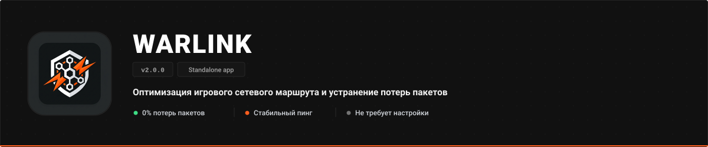
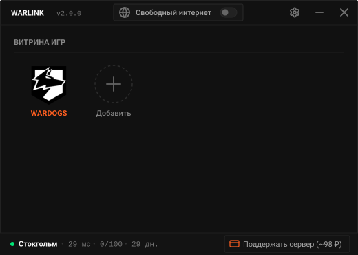

  

  
  
  

  
  
  
  

  

---

## Что решает WarLink?

Многие игроки **WARDOGS** и других онлайн-игр сталкиваются с сетевыми сбоями при подключении к серверам подбора матчей и лобби:
- Бесконечный поиск матча в лобби
- Ошибки «Connection lost / Server unreachable» при загрузке карты
- Высокий пинг, подергивания и внезапная потеря пакетов (packet loss)

**WarLink v2.0.4** в один клик стабилизирует сетевой маршрут к игровым узлам, обеспечивая комфортный пинг и стабильное подключение без вылетов и разрывов связи.

---

## Быстрый старт (за 30 секунд)

1. **Скачайте утилиту:** перейдите в раздел [Релизы](https://github.com/max-alekseyev/WarLink/releases/latest) и скачайте `WarLink.exe`.
2. **Поместите в отдельную папку:** сохраните файл в любую удобную папку (например, `C:\WarLink` или на Рабочий стол).
3. **Запустите `WarLink.exe`:** при запросе Windows нажмите *«Да»* (требуются права администратора для работы драйвера сетевой маршрутизации).
4. **Нажмите «ПОДКЛЮЧИТЬ»:** через несколько секунд маршрут будет готов, и можно запускать игру!

---

## Ключевые возможности WarLink v2.0.4

- **Выделенный игровой шлюз в Стокгольме:** собственный высокоскоростной сервер Hysteria 2 (QUIC/UDP) на прямых магистральных линиях в непосредственной близости к европейским серверам игр, устраняющий потери пакетов и ошибки входа в лобби.
- **Селективная маршрутизация процессов:** через шлюз направляется <u>исключительно</u> трафик WARDOGS. Все остальные программы, браузеры и игры работают напрямую на полной скорости вашего тарифа.
- **Режим «Свободный интернет»:** встроенный переключатель в шапке окна для стабильной работы Discord, голосового чата и мессенджеров без сторонних VPN.
- **Витрина ярлыков игр:** удобный выбор WARDOGS или добавление любых пользовательских игр (.exe или Steam) в один клик.
- **Блокирующее автообновление:** автоматическая проверка и бесшовное обновление приложения при старте со 100% сохранением всех пользовательских настроек (`config.json`).
- **Автозапуск в Steam:** запуск игры автоматически сразу после оптимизации сети.
- **Интеллектуальный возврат сети:** при выходе из игры WarLink автоматически разворачивается на экран и возвращает сеть в штатный режим без «висящих» сетевых служб.
- **Полная тишина:** никаких мигающих окон консоли, рекламы или сторонних системных прокси.

---

## Часто задаваемые вопросы (FAQ)

<b>1. Windows показывает синее окно «Система Windows защитила ваш компьютер». Что делать?</b>

 
Это стандартное предупреждение фильтра <b>Windows SmartScreen</b> для любых новых независимых программ без платного цифрового сертификата. 
  
<b>Решение:</b> нажмите <u>«Подробнее»</u>, затем <u>«Выполнить в любом случае»</u>. Программа полностью безопасна, а ее исходный код открыт для проверки.

<b>2. Зачем программе нужны права Администратора?</b>

 
Для низкоуровневой оптимизации и фильтрации игровых сетевых пакетов используется системный драйвер <code>WinDivert</code>. Политика безопасности Windows разрешает управление сетевыми драйверами только от имени Администратора.

<b>3. Влияет ли программа на обычный интернет после выхода?</b>

 
<b>Нет.</b> При закрытии программы или завершении игры туннель отключается, драйвер выгружается из памяти, а сетевые настройки Windows возвращаются к стандартному прямому подключению вашего провайдера.

<b>4. Антивирус предупреждает о файле WinDivert. Это нормально?</b>

 
Да. <code>WinDivert64.sys</code> — это официальный системный драйвер фильтрации пакетов с открытым исходным кодом. Из-за взаимодействия с сетевым стеком эвристические сканеры некоторых антивирусов могут выдавать ложные предупреждения (False Positive). При необходимости добавьте папку программы в исключения.

---

## Системные требования

- **ОС:** Windows 10 / Windows 11 (64-bit)
- **Привилегии:** Права Администратора (для загрузки драйвера WinDivert)
- **Клиент:** Установленный клиент Steam или поддерживаемые игры

---

## Сообщество и обратная связь

- **Вопросы и помощь сообщества:** [Ветка обсуждений (GitHub Discussions)](https://github.com/max-alekseyev/WarLink/discussions)
- **Нашли ошибку или сбой у провайдера?** [Создайте обращение (Bug Report)](https://github.com/max-alekseyev/WarLink/issues/new/choose)
- **Предложить идею:** [Категория Ideas в обсуждениях](https://github.com/max-alekseyev/WarLink/discussions/categories/ideas)

---

## Поддержать автора

Если **WarLink** помог вам комфортно играть и пользоваться сервисами, вы можете поддержать развитие проекта:

- **Boosty:** [boosty.to/pld1n/donate](https://boosty.to/pld1n/donate)
- **Карта Т-Банк:** `5536 9139 3500 4040`

---

## Лицензия

Проект распространяется под свободной лицензией [MIT](LICENSE).
Авторские права и лицензии всех используемых сторонних компонентов (zapret, WinDivert, sing-box, Wintun, Cygwin, Lucide Icons, go-webview2) приведены в файле [LICENSE](LICENSE).

---

## График популярности (Star History)

  

---

* Деятельность корпорации Meta (включая соцсети Facebook и Instagram) признана экстремистской и запрещена на территории РФ.

