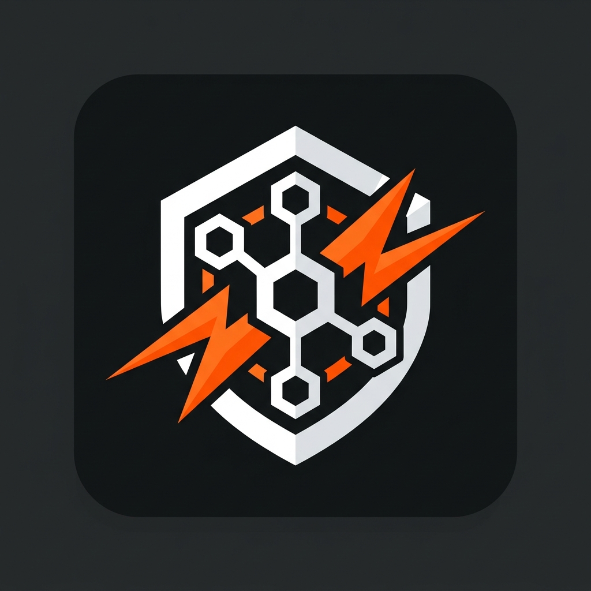
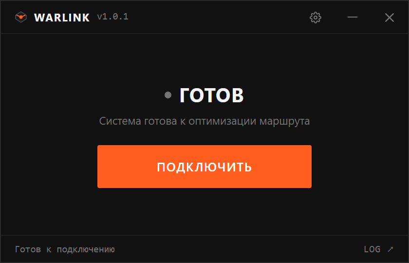

  

<h1 align="center">WarLink</h1>

  <b>Автономная утилита для оптимизации игрового сетевого маршрута и устранения потерь пакетов в WARDOGS</b>

  
  
  
  
  

  

---

## 🎯 Что решает WarLink?

Многие игроки **WARDOGS** сталкиваются с сетевыми сбоями при подключении к серверам подбора матчей и лобби:
- ❌ Бесконечный поиск матча в лобби
- ❌ Ошибки «Connection lost / Server unreachable» при загрузке карты
- ❌ Высокий пинг, подергивания и внезапная потеря пакетов (packet loss)

**WarLink** в один клик стабилизирует сетевой маршрут к игровым узлам, обеспечивая комфортный пинг и стабильное подключение без вылетов и разрывов связи.

---

## 🚀 Быстрый старт (за 30 секунд)

1. **Скачайте утилиту:** перейдите в раздел [Релизы](https://github.com/max-alekseyev/WarLink/releases/latest) и скачайте `WarLink.exe`.
2. **Поместите в отдельную папку:** сохраните файл в любую удобную папку (например, `C:\WarLink` или на Рабочий стол).
3. **Запустите `WarLink.exe`:** при запросе Windows нажмите *«Да»* (требуются права администратора для работы драйвера сетевой маршрутизации).
4. **Нажмите «ПОДКЛЮЧИТЬ»:** через несколько секунд маршрут будет готов, и можно запускать WARDOGS!

  

---

## ✨ Ключевые возможности

- ⚡ **Управление в один клик:** никаких консольных команд, сложных конфигураций и ручной настройки.
- 🎮 **Автозапуск WARDOGS в Steam:** возможность запуска игры автоматически сразу после оптимизации сети.
- 🔄 **Интеллектуальный возврат сети:** при выходе из игры WarLink автоматически разворачивается на экран и возвращает сеть в штатный режим.
- 🔕 **Полная тишина:** никаких мигающих окон консоли и лишних иконок в панели задач.
- 🛡️ **Защита настроек:** не прописывает сторонних системных прокси и не забивает автозагрузку Windows.

---

## ❓ Часто задаваемые вопросы (FAQ)

<b>1. Windows показывает синее окно «Система Windows защитила ваш компьютер». Что делать?</b>

 
Это стандартное предупреждение фильтра <b>Windows SmartScreen</b> для любых новых независимых программ без платного цифрового сертификата. 
  
<b>Решение:</b> нажмите <u>«Подробнее»</u>, затем <u>«Выполнить в любом случае»</u>. Программа полностью безопасна, а ее исходный код открыт для проверки.

<b>2. Зачем программе нужны права Администратора?</b>

 
Для низкоуровневой оптимизации и фильтрации игровых сетевых пакетов используется системный драйвер <code>WinDivert</code>. Политика безопасности Windows разрешает управление сетевыми драйверами только от имени Администратора.

<b>3. Влияет ли программа на обычный интернет после выхода?</b>

 
<b>Нет.</b> При закрытии программы или завершении игры туннель отключается, драйвер выгружается из памяти, а сетевые настройки Windows возвращаются к стандартному прямому подключению вашего провайдера.

<b>4. Антивирус предупреждает о файле WinDivert. Это нормально?</b>

 
Да. <code>WinDivert64.sys</code> — это официальный системный драйвер фильтрации пакетов с открытым исходным кодом. Из-за взаимодействия с сетевым стеком эвристические сканеры некоторых антивирусов могут выдавать ложные предупреждения (False Positive). При необходимости добавьте папку программы в исключения.

---

## 💻 Системные требования

- **ОС:** Windows 10 / Windows 11 (64-bit)
- **Привилегии:** Права Администратора (для загрузки драйвера WinDivert)
- **Клиент:** Установленный клиент Steam с игрой WARDOGS

---

## 💬 Сообщество и обратная связь

- 💬 **Вопросы и помощь сообщества:** [Ветка обсуждений (GitHub Discussions)](https://github.com/max-alekseyev/WarLink/discussions)
- 🐛 **Нашли ошибку или сбой у провайдера?** [Создайте обращение (Bug Report)](https://github.com/max-alekseyev/WarLink/issues/new/choose)
- 💡 **Предложить идею:** [Категория Ideas в обсуждениях](https://github.com/max-alekseyev/WarLink/discussions/categories/ideas)

---

## ☕ Поддержать автора

Если **WarLink** помог вам комфортно играть в WARDOGS без вылетов и сетевых ошибок, вы можете поддержать развитие проекта:

- 🧡 **Boosty:** [boosty.to/pld1n/donate](https://boosty.to/pld1n/donate)
- 💳 **Карта Т-Банк:** `5536 9139 3500 4040`

---

## ⭐ График популярности (Star History)

  

